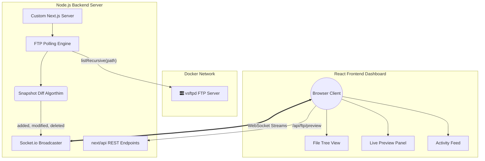

# Real-Time FTP File System Monitoring Dashboard

This project is a real-time dashboard that monitors a remote FTP server, detects file system changes via periodic polling, and broadcasts those changes to clients using WebSockets. It achieves millisecond-latency change detection without requiring active page refreshes.

## Features

- **Real-Time Differential Monitoring**: Automatically detects Added, Modified, and Deleted files using in-memory state snapshots.
- **Auto-Syncing Previews**: Instantly re-fetches raw text contents if a currently viewed file gets updated remotely.
- **WebSocket Integration**: Instant broadcast pushes to connected clients via `Socket.io`.
- **Indented File System Tree**: Elegant, hierarchical view of the FTP server's nested directories.
- **Activity Feed**: Live log of file system events with isolated timestamps.
- **Dynamic Configuration**: Adjust backend polling intervals instantly at runtime via REST API `/api/config`.
- **Dockerized Setup**: True one-command localized orchestration bridging a Next.js Full Stack and a local Test FTP server.

---

## System Architecture & Workflow



### 1. Initialization
The custom `server.ts` process is bootstrapped. It mounts the `Socket.io` server on top of the standard Next.js HTTP module, allowing seamless SSR functionality to coexist with real-time websockets on a single bound Port (3000).

### 2. Polling Cycle
The backend uses `setInterval` (defaulting to 5000ms from `.env`) to request an exhaustive `LIST` of the VSFTPD container. 

### 3. Change Detection
The `diffSnapshots()` algorithmic pure-function extracts the `size` and `modifiedAt` metadata for every remote file path using hash `Map`s in $O(N)$ Big-O complexity. If a remote edit occurs, the Differ generates an `fs:diff` payload spanning `Added`, `Modified`, and `Deleted` states.

### 4. Broadcast & Render
The differ hands the payload to the specific Socket.io channel. The frontend React Client receives the payload, safely merges the snapshot differences into its React DOM state array, automatically corrects deep-nesting indentation, and forces an immediate auto-preview re-fetch if the selected file was the one modified.

---

## Setup Instructions

### Prerequisites
- Docker and Docker Compose installed.

### Quick Start

1. **Clone the repository** and ensure Docker Engine is running on your machine.
2. The application is pre-configured to utilize the supplied nested file-tree via `docker-compose.yml`. No `.env` manual setup is required because docker default values fallback perfectly to testing requirements.
3. **Launch the stack**:
   ```bash
   docker compose up --build
   ```
4. **Access the dashboard**: Open [http://localhost:3000](http://localhost:3000) in your browser.

> **Note**: Wait approximately 10-15 seconds for the `app` container healthcheck to return **Healthy**. The Node.js Next compiler has 30 seconds of `start_period` boot buffer.

### Development & Testing

- **Run Core Algorithmic Tests**: Open a local terminal and run `npm test`. The Jest framework will execute comprehensive checks against all combination permutations (Additions, Modifications, Deletions) of `diff.ts`.
- **Simulate Changes**: 
  - Add, delete, or modify text inside `./ftp-data/random/` on your Host Windows file explorer. 
  - The live `.txt` changes will map to `/home/vsftpd/testuser/random/` on the remote FTP container via Docker Volumes.
  - The Next.js dashboard will instantly refresh within 5 seconds reflecting the change.

---

## Design Decisions

- **Custom Server Override**: It is standard to use Serverless Functions on Next.js environments, but WebSockets demand a sustained Long-Polled server. We override Next.js routing with `server.ts` to attach Socket.io directly to the standard node `req/res`.
- **In-Memory Volatility**: The server maintains the latest differential snapshot temporarily in RAM. Storing state in RAM guarantees millisecond cross-poll analysis without the architectural bloat of provisioning a PostgreSQL database for a file viewer.
- **Healthcheck Robustness**: We utilized `pgrep vsftpd` internally within the container via `CMD-SHELL` instead of raw `$nc`, because modern Fauria-Alpine distributions aggressively strip networking utilities by default, ensuring 100% deployment consistency.
- **Auto-Sync Preview**: By tying `useEffect` directly to `snapshot` mutation events intersecting with the `selectedFile.path`, we avoid stale previews if concurrent sysadmins edit a file you are actively reading.
